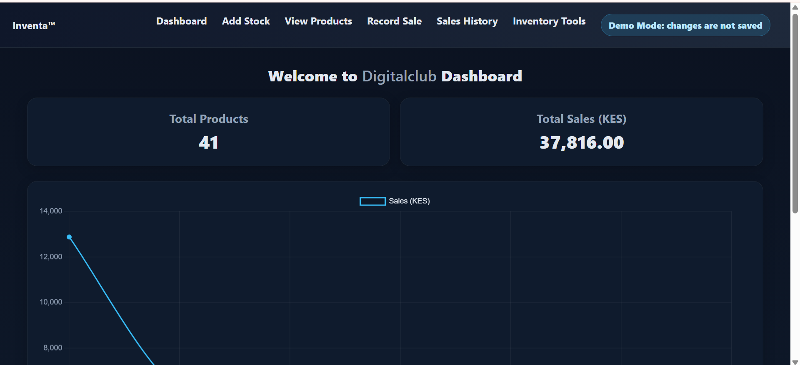
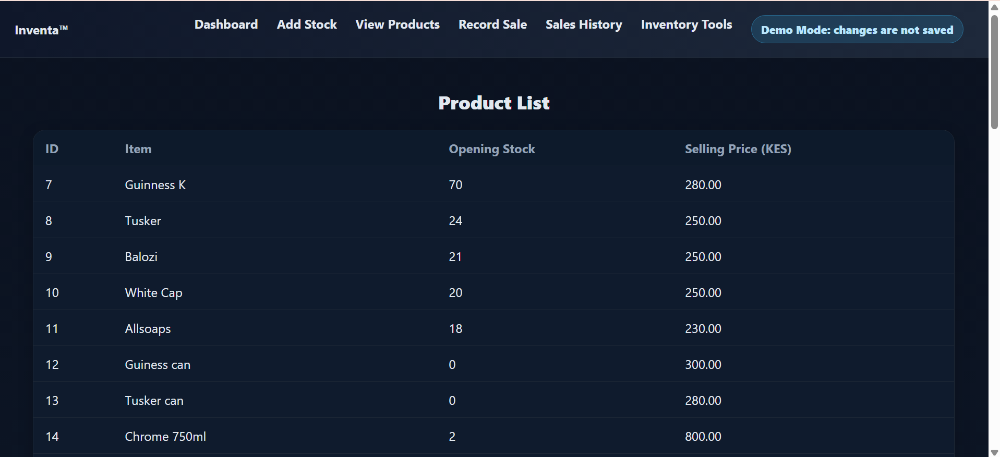
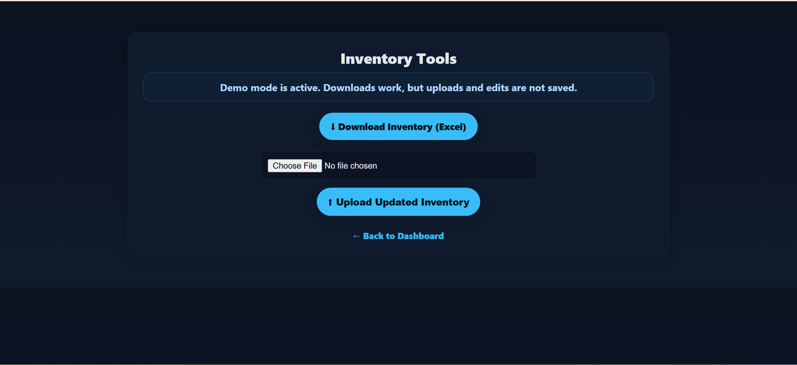

# Inventa™ — Multi-Tenant Inventory & Sales SaaS

Inventa™ is a production-ready inventory and sales management platform designed to handle real-world business operations across multiple tenants.

Built by Kwetu Partners Ltd, the system focuses on operational simplicity, stock visibility, structured workflows, and scalable SME business management.

---

## 🚀 Overview

Inventa™ provides a complete workflow for managing inventory and sales operations in a structured and scalable environment.

The platform supports:

- Real-time inventory tracking
- Multi-item sales processing
- Automated invoice generation
- Bulk stock management
- Business-level tenant separation
- Operational reporting and analytics

This project represents Kwetu Partners' practical engineering philosophy:
build reliable systems that solve real operational problems without unnecessary complexity.

---

# Why Inventa Exists

Inventa™ was born from firsthand operational experience inside the FMCG distribution industry in Kenya.

After decades of observing stock losses, manual ledger inefficiencies, delayed reporting, fragmented sales workflows, and operational waste, Kwetu Partners began building practical software systems focused on clarity, reliability, and efficiency.

Rather than chasing unnecessary enterprise complexity, Inventa™ follows a Monozukuri-inspired engineering philosophy:

- Reduce operational waste
- Simplify business workflows
- Improve stock visibility
- Increase reporting accuracy
- Build reliable systems for real SMEs

The goal is simple:

Provide practical and affordable operational software for businesses that need structure, accountability, and growth without expensive enterprise overhead.

---

## 🧠 Core Features

### Multi-Tenant Architecture
Supports multiple business environments with isolated operational data.

### Dashboard Analytics
Provides sales trends, stock summaries, and operational visibility.

### Inventory Management
Real-time inventory updates with structured stock control workflows.

### Sales Processing
Supports multi-item transactions with automatic totals and VAT calculations.

### Invoice System
Generates professional PDF invoices with embedded QR codes.

### Sales History Tracking
Maintains full transaction history with downloadable invoice records.

### Bulk Stock Upload
Allows Excel-based inventory imports for faster onboarding and updates.

### Mobile-Responsive Interface
Optimized for desktop and mobile operational use.

### Production-Oriented Design
Structured for scalable deployment and future SaaS expansion.

---

## 🏗️ System Architecture

Inventa™ follows a modular Flask-based architecture designed for simplicity, maintainability, and operational reliability.

### Frontend
- HTML
- CSS
- Responsive UI Design

### Backend
- Python
- Flask Framework

### Database
- SQLite (development environment)
- PostgreSQL-ready architecture for production scaling

### Reporting & Utilities
- PDF Invoice Engine
- QR Code Generation
- Analytics Visualization Modules

---

## 📸 Screenshots

### Dashboard


### Inventory 



### Inventory Tools


---

## 🛠️ Tech Stack

### Backend
- Python
- Flask

### Frontend
- HTML
- CSS

### Database
- SQLite

### Libraries
- Flask
- Pandas
- Matplotlib
- QRCode
- pdfkit

---

## ⚙️ Installation

### 1. Clone Repository

```bash
git clone https://github.com/kwetu-stack/inventa-online-version.git
cd inventa-online-version
2. Create Virtual Environment (Windows)
python -m venv venv
venv\Scripts\activate
Mac / Linux
source venv/bin/activate
3. Install Requirements
pip install flask pandas matplotlib qrcode pdfkit
4. Run Application
python app.py
5. Access System
http://127.0.0.1:5000
💼 Usage
Dashboard

Monitor sales performance, stock movement, and operational summaries.

Inventory Tools

Import or manage inventory using Excel-based workflows.

Add Stock

Update product quantities and maintain stock visibility.

Record Sales

Process transactions and automatically generate invoices.

Sales History

Review past sales transactions and download invoice records.

🌐 Live Demo

Public Demo:
https://kwetupartners.net/live-demo.html

The live demo allows users to interact with the system in a sandbox environment without authentication barriers.

📈 Roadmap
v1.1
User authentication
Role-based access control
Improved tenant administration
v2.0
Full cloud SaaS deployment
PostgreSQL production infrastructure
Centralized tenant management
v2.1
Client onboarding workflows
Subscription billing system
Tenant usage controls
Future Vision
AI-assisted reporting insights
Advanced analytics
Multi-branch operational management
Integrated mobile companion tools
🏢 About Kwetu Partners

Kwetu Partners Ltd is a Kenyan software engineering company focused on practical operational systems for SMEs.

The company combines real-world operational experience with modern software engineering to build reliable, affordable business platforms across:

Inventory Management
Logistics & Dispatch
visitor & reception management system
Construction Management
Education Technology
Identity & Access Systems

Kwetu follows a Monozukuri-inspired engineering philosophy centered on craftsmanship, operational clarity, and long-term system reliability.

Website:
https://kwetupartners.net/

📄 License

MIT License — Free to use, modify, and distribute.

🌍 Built in Kenya

Designed and engineered by Kwetu Partners Ltd.

Built with a focus on solving real operational challenges faced by SMEs across emerging markets.